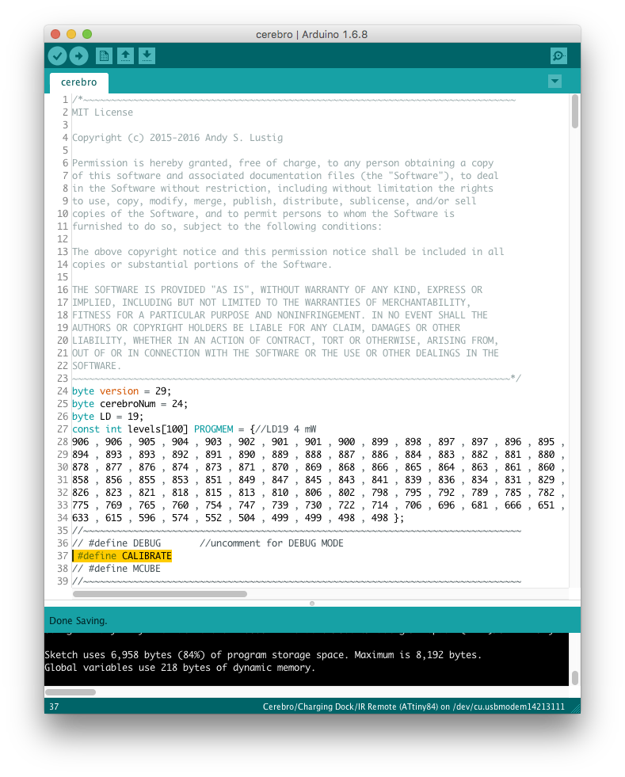

============
Head Implant
============
.. include:: isogrk1.txt
.. include:: mmlalias.txt
.. include:: isopub.txt

Required Tools
==============
  * Ruler
  * Soldering iron
  * Tweezers
  * `Fiber stripper <https://www.thorlabs.com/thorProduct.cfm?partNumber=T12S21>`_
  * `Fiber cleaver <http://www.fiberinstrumentsales.com/fis-lynx-precision-cleaver-with-fiber-basket.html>`_
  * `3-axis fiber launch system <http://www.thorlabs.com/thorproduct.cfm?partnumber=MBT612D/M>`_
  * `Power Meter and sensor <https://www.thorlabs.com/thorproduct.cfm?partnumber=PM121D>`_
  * `Ultraviolet light adhesive curing gun <https://www.norlandprod.com/lightsourc.html#led200>`_

Bill of Materials
=================
+-----+----------------------------------+-----------------------------------------------------------------+--------------------------------------------------------------------------------------------------------------------------------------------------------------------+
| Qty | Description                      | Datasheet                                                       | Vendor                                                                                                                                                             |
+=====+==================================+=================================================================+====================================================================================================================================================================+
| 1   | Implant PCB                      |                                                                 | `OSH Park <https://oshpark.com/shared_projects/5K1XYmmy>`_                                                                                                         |
+-----+----------------------------------+-----------------------------------------------------------------+--------------------------------------------------------------------------------------------------------------------------------------------------------------------+
| 2   | Laser Diodes                     | :download:`PLT5 520<Datasheets/PLT5 520.pdf>`                   | `World Star Tech <http://worldstartech.com/products/description/25/index>`_                                                                                        |
+-----+----------------------------------+-----------------------------------------------------------------+--------------------------------------------------------------------------------------------------------------------------------------------------------------------+
| 1   | Fiber                            | :download:`FP200URT<Datasheets/FP200URT.pdf>`                   | `ThorLabs <https://www.thorlabs.com/thorproduct.cfm?partnumber=FP200URT>`_                                                                                         |
+-----+----------------------------------+-----------------------------------------------------------------+--------------------------------------------------------------------------------------------------------------------------------------------------------------------+
| 1   | Norland Optical Adhesive 68      | `NOA 68 <https://www.norlandprod.com/adhesives/noa%2068.html>`_ | `Norland Products <https://www.norlandproducts2.com/adhesives/adproductsdetail_header_removed.asp?Prdid=68>`_                                                      |
+-----+----------------------------------+-----------------------------------------------------------------+--------------------------------------------------------------------------------------------------------------------------------------------------------------------+
| 2   | Ferrule                          | :download:`MM-FER2007C-2500<Datasheets/MM-FER2007C-2500.pdf>`   | `Precision Fiber Products <http://www.precisionfiberproducts.com/pfp-lc-1-25mm-od-multimode-ceramic-zirconia-ferrules/>`_                                          |
+-----+----------------------------------+-----------------------------------------------------------------+--------------------------------------------------------------------------------------------------------------------------------------------------------------------+
| 1   | Epoxy                            | :download:`T120-023-CX<Datasheets/T120-023-CX.pdf>`             | `FIS <http://www.fiberinstrumentsales.com/fis-room-cure-epoxy-2-grams.html>`_                                                                                      |
+-----+----------------------------------+-----------------------------------------------------------------+--------------------------------------------------------------------------------------------------------------------------------------------------------------------+
| 1   | Liquid electric tape             |                                                                 | `Amazon <http://www.amazon.com/Star-brite-Liquid-Electrical-Tape/dp/B000QUW4EE/ref=sr_1_1?ie=UTF8&qid=1463746324&sr=8-1&keywords=electrical+tape+liquid+tube>`_    |
+-----+----------------------------------+-----------------------------------------------------------------+--------------------------------------------------------------------------------------------------------------------------------------------------------------------+
| 1   | Photocell                        | :download:`PDV-P9005-1<Datasheets/PDV-P9005-1.pdf>`             | `Octopart <https://octopart.com/bom-lookup/HBO7aiJs>`_                                                                                                             |
+-----+----------------------------------+-----------------------------------------------------------------+                                                                                                                                                                    +
| 1   | Female micro USB vertical socket | :download:`105133-001<Datasheets/105133-001.pdf>`               |                                                                                                                                                                    |
+-----+----------------------------------+-----------------------------------------------------------------+                                                                                                                                                                    +
| 1   | 0805 6.8 k\ |OHgr| Resistor      |                                                                 |                                                                                                                                                                    |
+-----+----------------------------------+-----------------------------------------------------------------+--------------------------------------------------------------------------------------------------------------------------------------------------------------------+

Assembly Instructions
=====================
#. Strip fiber and cut to length
#. Align fiber to laser diode
#. Apply Norland Optical Adhesive 68 and cure it with UV adhesive curing gun
#. Laser cut fiber guide
#. Sand down ferrule to width of acrylic
#. Insert ferrules into acrylic to create fiber guide
#. Thread coupled fibers through fiber guide
#. Surround assembly with epoxy
#. Place photocell in epoxy
#. Cover photocell/epoxy with liquid electrical tape
#. Solder laser diodes onto implant PCB

Calibration Instructions
========================
The is variation in head implant assemblies. Laser diodes, coupling efficency, LDR postion in relation to the laser diodes. In order to compensate for all of this variability, each assembly must be calibrated
so we know the relation between our power variable in our code and the actual light power being produced at the fiber tips.

1. Follow the :ref:`instructions <cerebro upload>` for uploading Cerebro Firmware. Delete line 37's preceding '//' to uncomment '#define CALIBRATE' before uploading the firmware.

2. Connect Cerebro to the Head Implant, and secure them in a test fixture with the fibers pointing into a Light Power Meter.

.. figure:: photos/Calibration_photos/fixture.jpg
  :align: center
  :scale: 100%

3. Open up the Light Power Meter software and change the following settings:

  - Range: 120mW
  - Wave: 520nm
  - Log Configuration

    - No of Samples: 150000
    - Averaging: 1
    - Fast logging to file: \ |check|

.. figure:: photos/Calibration_photos/settings_combined.png
  :align: center
  :scale: 100%

4. Make sure Cerbero is turned on and then click "Start Log"
#. Using either a Base Station or IR remote, send the following new waveform paratmeters: 0 power, 2000 on , 0 off, 0 train, 0 ramp
#. Using either a Base Station or IR remote, send a trigger signal to Cerebro to begin the calibration routine
#. Run Python script on the log file to to get calibration summary
#. In Cerebro.ino, replace the "const int levels[100]" variable with the code found in the calibration summary file

.. figure:: photos/Calibration_photos/calVals.png
  :align: center
  :scale: 100%

Design Files
============
PCB
	- :download:`Implant 4.4.brd<../../../PCB Files/Implant 4.4/Implant 4.4.brd>`
	- :download:`Implant 4.4.sch<../../../PCB Files/Implant 4.4/Implant 4.4.sch>`
	- :download:`Schematic.pdf<../../../PCB Files/Implant 4.4/Implant 4.4 schematic.pdf>`

Lasercut
  - :download:`Fiber guide_1,5mm gap.dxf<../../../Lasercut/Fiber guide/Fiber guide_1,5mm gap.dxf>`
  - :download:`Fiber guide_1,5mm gap.ai<../../../Lasercut/Fiber guide/Fiber guide_1,5mm gap.ai>`
