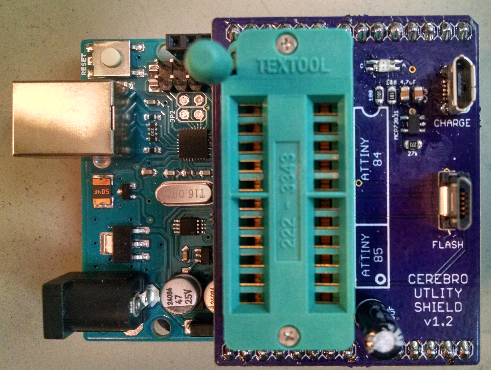
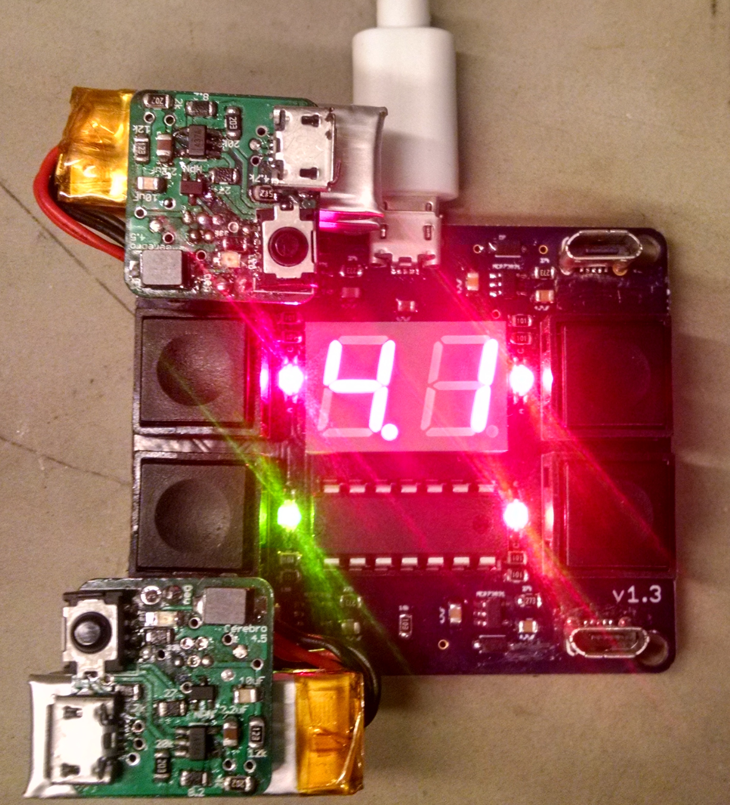

================
System Overview
================
.. include:: isogrk1.txt
.. include:: mmlalias.txt

Cerebro
-------

.. image:: cerebro.jpg
  :align: center
  :scale: 20 %

Cerebro is a rechargable wireless receiver that connects to a head implant assembly. Cerebro receives commands from a :ref:`base station` and delivers power to
the laser diodes on the head implant, resulting in light being emitted through the optical fibers into the brain. The
intensity and waveform of the emitted light can be adjusted wirelessly during an experiment (:ref:`How to change Pulse Parameters <pulse change header>`).
All commands sent to Cerebro are saved along with timestamps to onboard non-volatile memory.

:doc:`More info... <../Hardware/cerebro>`

Head Implant
------------

.. image:: implant.jpg
  :align: center
  :scale: 10 %

The head implant assembly consists of two laser diodes coupled to optical fibers. Also included is a light dependent resistor (LDR) that is used as feedback
to maintain a constant light output.

:doc:`More info... <../Hardware/implant>`

.. _base station:

Base Station
------------
.. image:: base_station.jpg
  :align: center
  :scale: 15 %

The Base Station is responsible for emitting infrared light signals to communicate wirelessly with Cerebro (exactly like a TV remote).
It is connected by USB to a Windows computer, where commands can be sent and events can be logged using :ref:`Xavier <xavier>`.
Base Station can also be controlled directly by `TTL <https://learn.sparkfun.com/tutorials/logic-levels#ttl-logic-levels>`_ signals going into
its RJ45 connector. A high TTL signal on pin3 of the RJ45 causes a trigger signal to be emitted, and a high TTL signal on pin2 causes
a stop signal to be emitted. Events will still be logged by Xavier even when triggered by a TTL.

:doc:`More info... <../Hardware/implant>`

.. _utility shield:

Utility Shield
--------------

The Utility Shield connects to an `Arduino Uno <https://www.arduino.cc/en/main/arduinoBoardUno>`_ and is used to flash programs to a variety of AVR microcontrollers.
It can flash the ATtiny84 DIP used by the IR Remote and Charging Dock, the ATtiny84 SOIC used by Cerebro, the ATtiny85 DIP used by the Base Station, and the ATmega328P
used by the IR Remote. The shield also provides a charging port for Cerebro that has a green/red charging indicator light.

:doc:`More info... <../Hardware/utility shield>`

Charging Dock
-------------

The Charging Dock provides ports for charging up to 4 Cerebro receivers at one time. A 2-digit display shows
the voltage of a Cerebro when the corresponding button is pressed. When Cerebro becomes fully charged (~4.2v) an
indicator led changes from red to green.

:doc:`More info... <../Hardware/charging dock>`

IR Remote
---------

.. image:: IR_remote.jpg
  :align: center
  :scale: 20 %

The IR Remote is a handheld remote that can be used to send commands to Cerebro.
Information including battery status, current parameters, and ID number can be checked by plugging a Cerebro Receiver into the IR Remote.

:doc:`More info... <../Hardware/remote>`

.. _cord:

Downloader Cord
---------------
.. image:: downloader.jpg
  :align: center
  :scale: 15 %

The Downloader Cord is used for serial communication between a computer and Cerebro. Once connected to Cerebro's
micro usb port, it can be used for downloading log data off of Cerebro's EEPROM, or it can be used to display
messages when Cerebro is in debugging mode.

:doc:`More info... <../Hardware/downloader cord>`

.. _xavier:

Xavier
------

.. image:: xavier_demo.png
    :align: center
    :scale: 80 %

Xavier is a GUI for sending and logging Base Station commands. Since communication between Cerebro and Base Station is unidirectional, in order to truly know what occurs throughout an experiment,
every event that is received by Cerebro is also saved to an onboard log.  After an experiment is complete, Cerebro's onboard logfile can be
downloaded into Xavier. The two log files can then be saved and analyzed to confirm that everything that was sent by Base Station was in fact received and executed by Cerebro.
Xavier provides an easy interface for sending parameter changes and can also be used a debugging tool.

:doc:`More info... <../Software/Xavier>`
