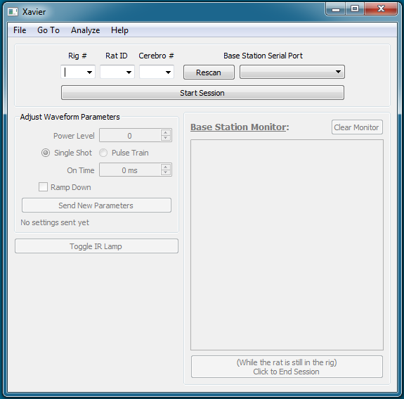
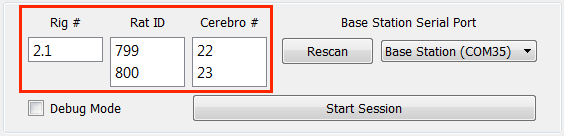
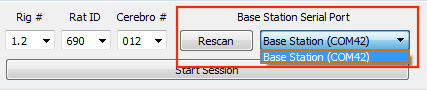
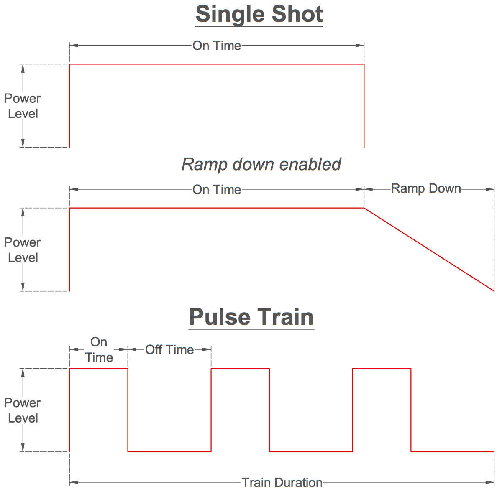
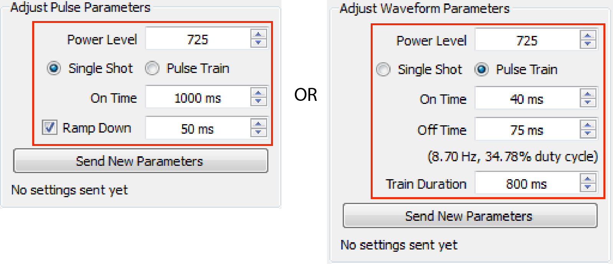
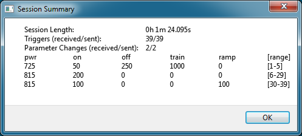
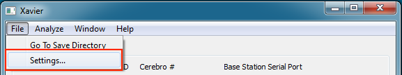
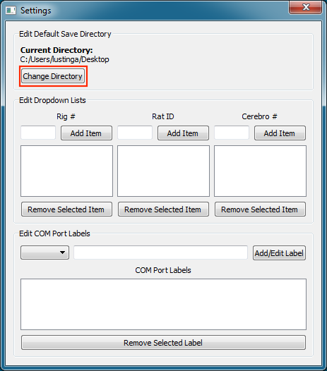

======
Xavier
======



Installation
****************

System Requirements
===================
  - Windows XP or newer
  - `FTDI FT230X Driver <http://www.ftdichip.com/Drivers/VCP.htm>`_
  - `Anaconda Python 2.7 Distribution <http://continuum.io/downloads>`_

  .. _setup default:

Download Instructions
=====================
1. Download and install `Anaconda Python 2.7 Distribution <http://continuum.io/downloads>`_
2. Download and unzip :download:`Xavier Deployment Folder<../../../QT/CCS/Deployment.zip>`
3. Open up Xavier.exe

.. figure:: photos/Install/Xavier_open.png
    :align: center
    :scale: 75%

4. Setup a :ref:`default directory<edit default directory>` that data will be saved to

.. _User Guide:

Xavier User Guide
*****************
.. .. raw:: html
..
..   <center><iframe width="420" height="315" src="https://www.youtube.com/embed/SBqYZ3KdAUc" frameborder="0" allowfullscreen></iframe></center>


Starting a New Session
======================
1. Fill out experimental setup information.



2. Select a Base Station Serial Port.



3. Click ``Start Session``

.. image:: photos/Start_session/start_session.png
    :align: center
    :scale: 100%

.. seealso::
  The dropdown menus can be :ref:`edited <add items>` and COM Ports that appear in the dropdown list can be :ref:`labeled<label ports>`


.. _waveform parameters:

Waveform Parameters
===================
Five waveform parameters (Power Level, On Time, Off Time, Train Duration, Ramp Down) can be changed throughout the session.
The user can make changes using either a **Single Shot** mode with an optional ramp down or **Pulse Train** mode. Non-applicable parameters are automatically set to zero depending on
options selected. Once the parameters are sent to and received by Cerebro, they are saved to non-volatile memory and are therefore retained eventherefore accessible even after the device is turned off.

Parameter Definitions
---------------------
Power Level
  Level of light output. Each laser diode assembly is calibrated to provide a range of power level values that correspond with known light power (mW) outputs.
On Time (ms)
  Duration the laser is on at the given Power Level
Ramp down (ms) [Single Shot mode only]
  Time it takes for the laser to linearly reduce its output from Power Level to completely off. Must be a mulitple of 100 ms.
Off Time (ms) [Pulse Train mode only]
  Duration the laser is off
Train Duration (ms) [Pulse Train mode only]
  Duration that the on-off cycles are repeated



.. _pulse change header:

Changing Parameters
-------------------
1. In the "Adjust Pulse Parameters" section, select desired pulse options and modify the parameters



2. Click ``Send New Parameters``. The last sent parameters will be displayed at the bottom

.. figure:: photos/Edit_waveform/last_sent.png
  :align: center
  :scale: 135%

.. seealso::
  The IR Remote can be used as an alternative to :ref:`send new parameters <remote send>`. Additionally, it is capable of :ref:`checking the current parameters <remote check>`  saved to Cerebro's memory.

.. 1. Open the "Upload Monitor" by going to **Window->Upload Monitor**
..
.. .. image:: photos/Guide_photos/show_uploadMonitor.png
..   :align: center
..   :scale: 100%
..
.. 2. Make sure the :ref:`cord` is plugged into the computer
.. 3. Select the appropriate Serial Port and click ``Connect to Uploader``
..
.. .. image:: photos/Guide_photos/connect_uploader.png
..   :align: center
..   :scale: 100%
..
.. 4. With Cerebro turned off, plug the :ref:`cord` into Cerebro
.. 5. Switch on Cerebro. A summary of the Firmware and pulse parameters will be printed to the "Upload Monitor"
..
.. .. image:: photos/Guide_photos/parameter_check.png
..     :width: 55%
..
.. .. image:: photos/Guide_photos/parameter_view.png
..     :width: 44%

.. _upload header:

Ending a Session and Saving Data
================================

.. important::
  1. Before opening the rig and removing the rat, click the ``End Session`` button.

.. image:: photos/End_session/end_session.png
  :align: center
  :scale: 100%

2. Turn off Cerebro and disconnect it from the rat's head implant
3. Make sure the :ref:`cord` is plugged into the computer
4. A "Download Monitor" tab should have automatically appeared after step 1. In this tab, select the appropriate Serial Port and click ``Connect to Downloader``

.. image:: photos/End_session/connect_uploader.png
  :align: center
  :scale: 100%

5. Plug the :ref:`cord` into Cerebro's micro usb port
6. Press and hold the download button
7. While still holding down the download button, switch Cerebro on. The event log will be printed to the Download Monitor.
   You may release the download button once events have begun being printed to the Cerebro Monitor.

.. image:: photos/End_session/upload.png
  :align: center
  :scale: 20%

8. Click ``Save Session`` button.

.. image:: photos/End_session/save_session.png
  :align: center
  :scale: 100%

9. After saving, a dialog will appear with a summary of the session




Xavier Settings
===============
Access Xavier Settings by navigating to **File->Settings..** or by pressing :kbd:`Ctrl` + :kbd:`,`



.. note::
  Settings cannot be changed in the middle of a session

.. _edit default directory:

Edit Default Save Directory
-------------------------------

1.  Click ``Change Directory`` to setup a new save location.



2. Navigate to an existing folder or create a new folder for future data.

.. figure:: photos/Settings/new_folder.png
    :align: center
    :scale: 60%

3. Finally, click **Select Folder**

.. figure:: photos/Settings/rename_and_select.png
    :align: center
    :scale: 60%

.. _add items:

Edit Dropdown Lists
-------------------
Adding Items
````````````
Type new items into dropdown list textboxes and click ``Add Item`` (or press :kbd:`Enter`)

.. image:: photos/Settings/additem.gif
  :align: center
  :scale: 100%

Removing Items
``````````````
Select the item from list you want to remove and click ``Remove Selected``

.. image:: photos/Settings/removeitem.gif
  :align: center
  :scale: 100%

.. _label ports:

Labeling COM Ports
------------------
When multiple usb devices are connected to the computer, it can be hard to keep track of which COM Port belongs to which device. To minimize confusion when connecting
to serial ports, Xavier allows you to label COM Ports.

.. image:: photos/Settings/port_labeling.png
  :align: center
  :scale: 100%

Adding Labels
`````````````
1. From the dropdown box, select the COM Port you want to add a label to
2. Type the new label into the textbox and click ``Add/Edit Label`` (or press :kbd:`Enter`)

.. image:: photos/Settings/addlabel.gif
  :align: center
  :scale: 100%

Editing Labels
``````````````
1. Double-click the labeled COM Port from the list that you want to edit. A label editing dialog will appear.
2. Type the new label into the textbox and click ``Change Label``

.. image:: photos/Settings/editlabel.gif
  :align: center
  :scale: 100%

Removing Labels
```````````````
Select the labeled COM Port from the list that you want to remove and click ``Remove Selected``

.. image:: photos/Settings/removelabel.gif
  :align: center
  :scale: 100%


.. View Results
.. ============
..
.. Debug Mode
.. ==========
.. Debug mode allows you to manually send commands to Base Station
