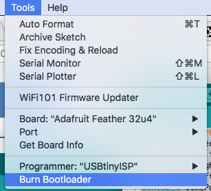

=================
Cerebro Resources
=================

.. include:: Characters/isogrk1.txt
.. include:: Characters/mmlalias.txt

.. .. image:: ../Overview/cerebro.jpg
..   :align: center
..   :scale: 100 %

Bill of Materials
=================
+-----+---------------------------------+-------------------------------------------------------------------+------------------------------------------------------------------------------------------------------------------------------------------+
| Qty | Description                     | Datasheet                                                         | Order Link                                                                                                                               | 
+=====+=================================+===================================================================+==========================================================================================================================================+
| 1   | Cerebro PCB                     |  :download:`Cerebro 5.6<Datasheets/cerebro5.6.pdf>`               | `OSH Park <https://oshpark.com/projects/sPd5KOMe>`_                                                                                      | 
+-----+---------------------------------+-------------------------------------------------------------------+------------------------------------------------------------------------------------------------------------------------------------------+
| 1   | 400 mAh Battery                 |  :download:`1570<Datasheets/battery_400mah.pdf>`                  | `Sparkfun <https://www.sparkfun.com/products/13851>`_                                                                                    | 
+-----+---------------------------------+-------------------------------------------------------------------+------------------------------------------------------------------------------------------------------------------------------------------+
| 1   | 915 MHz Radio                   |  :download:`RFM69HCW<Datasheets/radio.pdf>`                       | `LowPowerLab <https://lowpowerlab.com/shop/product/158>`_                                                                                | 
+-----+---------------------------------+-------------------------------------------------------------------+------------------------------------------------------------------------------------------------------------------------------------------+
| 1   | Microcontroller                 |  :download:`ATMEGA32U4-MUR<Datasheets/MCU_32u4.pdf>`              | `Digi-Key <https://www.digikey.com/products/en?keywords=ATMEGA32U4-MURCT-ND>`_                                                           | 
+-----+---------------------------------+-------------------------------------------------------------------+------------------------------------------------------------------------------------------------------------------------------------------+
| 1   | 8 MHz Resonator                 |  :download:`CSTCE8M00G55-R0<Datasheets/resonator_8mhz.pdf>`       | `Digi-Key <https://www.digikey.com/products/en?keywords=490-1195-1-ND>`_                                                                 | 
+-----+---------------------------------+-------------------------------------------------------------------+------------------------------------------------------------------------------------------------------------------------------------------+
| 1   | 3.3V Linear Regulator           |  :download:`AP2112K-3.3TRG1<Datasheets/regulator_3v_linear.pdf>`  | `Digi-Key <https://www.digikey.com/products/en?keywords=%09AP2112K-3.3TRG1DICT-ND>`_                                                     | 
+-----+---------------------------------+-------------------------------------------------------------------+------------------------------------------------------------------------------------------------------------------------------------------+
| 1   | Fuel Gauge                      |  :download:`BQ27441DRZR-G1B<Datasheets/fuel_gauge.pdf>`           | `Digi-Key <https://www.digikey.com/product-detail/en/texas-instruments/BQ27441DRZR-G1B/296-39942-1-ND/5177819>`_                         | 
+-----+---------------------------------+-------------------------------------------------------------------+------------------------------------------------------------------------------------------------------------------------------------------+
| 2   | DAC (12-Bit)                    |  :download:`LTC2630ACSC6-LZ12#TRMPBF<Datasheets/DAC.pdf>`         | `Digi-Key <https://www.digikey.com/product-detail/en/linear-technology/LTC2630ACSC6-LZ12-TRMPBF/LTC2630ACSC6-LZ12-TRMPBFCT-ND/1643783>`_ | 
+-----+---------------------------------+-------------------------------------------------------------------+------------------------------------------------------------------------------------------------------------------------------------------+
| 2   | Op Amp                          |  :download:`OPA237NA/3K<Datasheets/opamp.pdf>`                    | `Digi-Key <https://www.digikey.com/products/en?keywords=296-26265-1-ND>`_                                                                | 
+-----+---------------------------------+-------------------------------------------------------------------+------------------------------------------------------------------------------------------------------------------------------------------+
| 2   | NPN Transistor                  |  :download:`FJX3904TF<Datasheets/npn_transistor.pdf>`             | `Digi-Key <https://www.digikey.com/products/en?keywords=FJX3904TFCT-ND>`_                                                                | 
+-----+---------------------------------+-------------------------------------------------------------------+------------------------------------------------------------------------------------------------------------------------------------------+
| 1   | Boost Converter                 |  :download:`MIC2288YD5-TR<Datasheets/boost_converter.pdf>`        | `Digi-Key <https://www.digikey.com/products/en?keywords=576-1729-1-ND>`_                                                                 | 
+-----+---------------------------------+-------------------------------------------------------------------+------------------------------------------------------------------------------------------------------------------------------------------+
| 1   | Schottky Diode                  |  :download:`MBRM140T3G<Datasheets/schottky.pdf>`                  | `Digi-Key <https://www.digikey.com/products/en?keywords=MBRM140T3GOSCT-ND>`_                                                             | 
+-----+---------------------------------+-------------------------------------------------------------------+------------------------------------------------------------------------------------------------------------------------------------------+
| 1   | 10uH Inductor                   |  :download:`LQH43CN100K03L<Datasheets/inductor.pdf>`              | `Digi-Key <https://www.digikey.com/products/en?keywords=490-2519-1-ND>`_                                                                 | 
+-----+---------------------------------+-------------------------------------------------------------------+------------------------------------------------------------------------------------------------------------------------------------------+
| 1   | Slide Switch                    |  :download:`AYZ0102AGRLC<Datasheets/slide_switch.pdf>`            | `Digi-Key <https://www.digikey.com/products/en?keywords=%09401-2012-1-ND>`_                                                              | 
+-----+---------------------------------+-------------------------------------------------------------------+------------------------------------------------------------------------------------------------------------------------------------------+
| 1   | Micro USB vertical plug         |  :download:`ZX20-B-5S-UNIT(30)<Datasheets/usb_plug_vertical.pdf>` | `Digi-Key <https://www.digikey.com/products/en?keywords=H125237-ND>`_                                                                    | 
+-----+---------------------------------+-------------------------------------------------------------------+------------------------------------------------------------------------------------------------------------------------------------------+
| 1   | Micro USB shielding             |  :download:`ZX20-B-SLDC<Datasheets/usb_shielding.pdf>`            | `Digi-Key <https://www.digikey.com/products/en?keywords=H11496CT-ND>`_                                                                   | 
+-----+---------------------------------+-------------------------------------------------------------------+------------------------------------------------------------------------------------------------------------------------------------------+
| 1   | Micro USB horizontal socket     |  :download:`10118194-0001LF<Datasheets/usb_plug_horizontal.pdf>`  | `Digi-Key <https://www.digikey.com/products/en?keywords=609-4618-1-ND>`_                                                                 | 
+-----+---------------------------------+-------------------------------------------------------------------+------------------------------------------------------------------------------------------------------------------------------------------+
| 1   | Molex MicroClasp socket         |  :download:`0559350230<Datasheets/microclasp.pdf>`                | `Digi-Key <https://www.digikey.com/products/en?keywords=wm12296-nd>`_                                                                    | 
+-----+---------------------------------+-------------------------------------------------------------------+------------------------------------------------------------------------------------------------------------------------------------------+
| 1   | Molex MicroClasp plug with wire | 0151360206                                                        | `Digi-Key <https://www.digikey.com/products/en?keywords=wm16380-nd>`_                                                                    | 
+-----+---------------------------------+-------------------------------------------------------------------+------------------------------------------------------------------------------------------------------------------------------------------+
| 1   | Red LED (0603)                  |  :download:`LTST-C191KRKT<Datasheets/led_red.pdf>`                | `Digi-Key <https://www.digikey.com/products/en?keywords=160-1447-1-ND>`_                                                                 | 
+-----+---------------------------------+-------------------------------------------------------------------+------------------------------------------------------------------------------------------------------------------------------------------+
| 1   | Amber LED (0603)                |  :download:`LNJ437W84RA<Datasheets/led_amber.pdf>`                | `Digi-Key <https://www.digikey.com/products/en?keywords=%09LNJ437W84RACT-ND>`_                                                           | 
+-----+---------------------------------+-------------------------------------------------------------------+------------------------------------------------------------------------------------------------------------------------------------------+
| 1   | 470 nF Capacitor (0805)         |                                                                   | `Digi-Key <https://www.digikey.com/product-detail/en/avx-corporation/08055C474KAT2A/478-5033-1-ND/1888244>`_                             | 
+-----+---------------------------------+-------------------------------------------------------------------+------------------------------------------------------------------------------------------------------------------------------------------+
| 2   | 1 |mgr|\F Capacitor (0805)      |                                                                   | `Digi-Key <https://www.digikey.com/products/en?keywords=1276-1066-1-nd>`_                                                                | 
+-----+---------------------------------+-------------------------------------------------------------------+------------------------------------------------------------------------------------------------------------------------------------------+
| 1   | 2.2 |mgr|\F Capacitor (0805)    |                                                                   | `Digi-Key <https://www.digikey.com/products/en?keywords=587-1286-1>`_                                                                    | 
+-----+---------------------------------+-------------------------------------------------------------------+------------------------------------------------------------------------------------------------------------------------------------------+
| 3   | 10 |mgr|\F Capacitor (0805)     |                                                                   | `Digi-Key <https://www.digikey.com/product-detail/en/murata-electronics-north-america/GRM21BR61E106KA73L/490-5523-1-ND/2334919>`_        | 
+-----+---------------------------------+-------------------------------------------------------------------+------------------------------------------------------------------------------------------------------------------------------------------+
| 1   | 0.01 |OHgr| Resistor (1206)     |                                                                   | `Digi-Key <https://www.digikey.com/products/en?keywords=P0.01BVCT-ND>`_                                                                  | 
+-----+---------------------------------+-------------------------------------------------------------------+------------------------------------------------------------------------------------------------------------------------------------------+
| 2   | 12 |OHgr| Resistor (0603)       |                                                                   | `Digi-Key <https://www.digikey.com/products/en?keywords=P12.00BYCT-ND>`_                                                                 | 
+-----+---------------------------------+-------------------------------------------------------------------+------------------------------------------------------------------------------------------------------------------------------------------+
| 4   | 27 |OHgr| Resistor (0603)       |                                                                   | `Digi-Key <https://www.digikey.com/products/en?keywords=541-27.0SCT-ND>`_                                                                | 
+-----+---------------------------------+-------------------------------------------------------------------+------------------------------------------------------------------------------------------------------------------------------------------+
| 1   | 2 k\ |OHgr| Resistor (0603)     |                                                                   | `Digi-Key <https://www.digikey.com/products/en?keywords=RNCP0603FTD2K00CT-ND>`_                                                          | 
+-----+---------------------------------+-------------------------------------------------------------------+------------------------------------------------------------------------------------------------------------------------------------------+
| 2   | 4.7 k\ |OHgr| Resistor (0603)   |                                                                   | `Digi-Key <https://www.digikey.com/products/en?keywords=311-4.70KHRCT-ND>`_                                                              | 
+-----+---------------------------------+-------------------------------------------------------------------+------------------------------------------------------------------------------------------------------------------------------------------+
| 2   | 12 k\ |OHgr| Resistor (0805)    |                                                                   | `Digi-Key <https://www.digikey.com/products/en?keywords=311-12.0KCRCT-ND>`_                                                              | 
+-----+---------------------------------+-------------------------------------------------------------------+------------------------------------------------------------------------------------------------------------------------------------------+
| 6   | 20 k\ |OHgr| Resistor (0603)    |                                                                   | `Digi-Key <https://www.digikey.com/products/en?keywords=RNCP0603FTD20K0CT-ND>`_                                                          | 
+-----+---------------------------------+-------------------------------------------------------------------+------------------------------------------------------------------------------------------------------------------------------------------+
| 2   | 100 k\ |OHgr| Resistor (0603)   |                                                                   | `Digi-Key <https://www.digikey.com/products/en?keywords=%09311-100KHRCT-ND>`_                                                            | 
+-----+---------------------------------+-------------------------------------------------------------------+------------------------------------------------------------------------------------------------------------------------------------------+

Build Instructions
==================

.. _programmming instructions:

Programming Instructions
========================

Cerebro is designed to be easily reprogrammed through the onboard micro USB. 
However when builing a Cerebro from scratch, you must first burn a `bootloader <https://www.arduino.cc/en/Tutorial/ArduinoISP>`_  onto the microcontroller in order to later upload programs through USB. 

To burn a bootloader you need an external programmer that will talk to the microntroller through ICSP. 
You can use an Arduino as your external ISP and temporarily solder wires to the Cerebro PCB. 
I recommmend using a `USB microISP <https://www.tindie.com/products/nsayer/usb-isp/?pt=ac_prod_search>`_ along with a :doc:`Pogo Connector <programmer>`.

1. The programmer needs to connect to the ICSP thru-holes (MOSI, MISO, SCK, RST, GND and 3V) on the Cerebro PCB.

.. figure:: photos/Programmer/programmer.jpg
  :align: center
  :scale: 100%

2. In the Arduino IDE, select Tools->Board->"Adafruit Feather 32u4" 
3. Select  Tools->Programmer->"USBtinyISP" or Tools->Programmer->"ArduinoISP" if using an Arduino as the programmer
4. Select Tools->Burn Bootloader

