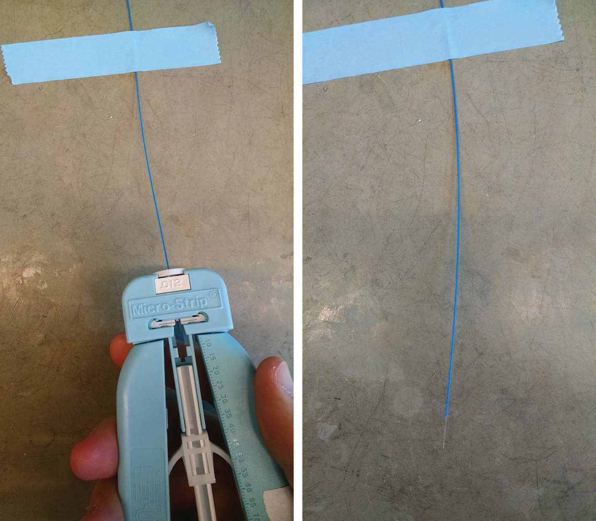
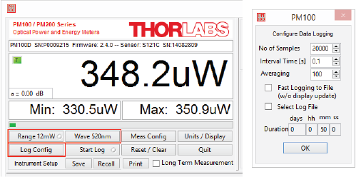

:github_url: https://github.com/Karpova-Lab/cerebro

============
Head Implant
============
.. include:: Characters/isogrk1.txt
.. include:: Characters/mmlalias.txt
.. include:: Characters/isopub.txt

.. figure:: photos/implant_cad.jpg
  :align: center
  :width: 100%

.. _implantTools:

Required Tools
==============
  * Ruler
  * Soldering iron
  * Tweezers   
  * `Fiber gripper <https://www.thorlabschina.cn/thorproduct.cfm?partnumber=BFG1>`_ 
  * `Fiber stripper <https://www.thorlabs.com/thorProduct.cfm?partNumber=T12S21>`_
  * `Fiber cleaver <http://www.fiberinstrumentsales.com/fis-lynx-precision-cleaver-with-fiber-basket.html>`_
  * `3-axis fiber launch system <http://www.thorlabs.com/thorproduct.cfm?partnumber=MBT612D/M>`_
  * `Power meter <https://www.thorlabs.com/thorproduct.cfm?partnumber=PM121D>`_ and `photodiode sensor <https://www.thorlabs.com/thorproduct.cfm?partnumber=S121C>`_
  * `Adjustable DC Power Supply <https://www.amazon.com/KORAD-KD3005D-Precision-Adjustable-Regulated/dp/B00FPU6G4E/ref=sr_1_2?s=hi&ie=UTF8&qid=1521832325&sr=1-2&keywords=korad+power+supply&dpID=41CeDR0WTPL&preST=_SY300_QL70_&dpSrc=srch>`_ 
  * `Ultraviolet light <https://www.amazon.com/TaoTronics-TT-FL001-Flashlight-Blacklight-Ultraviolet/dp/B00RV8PREI/ref=sr_1_1?ie=UTF8&qid=1484071557&sr=8-1&keywords=B00RV8PREI>`_

Bill of Materials
=================
+-----+-----------------------------+----------------------------------------------------------------+-------------------------------------------------------------------------------------------------------------------------+
| Qty | Description                 | Datasheet                                                      | Order Link                                                                                                              | 
+=====+=============================+================================================================+=========================================================================================================================+
| 1   | Implant PCB                 |  :download:`Implant 5.3<Datasheets/implant_5.3.pdf>`           | `OSH Park <https://oshpark.com/shared_projects/k8Ikpli6>`__                                                             | 
+-----+-----------------------------+----------------------------------------------------------------+-------------------------------------------------------------------------------------------------------------------------+
| 1   | Laser Diode                 |  :download:`PLT5 520_B1_2_3<Datasheets/green_laser_diode.pdf>` | `World Star Tech <http://www.worldstartech.com/products/laser-diodes/green-laser-diode-osram/>`__                       | 
+-----+-----------------------------+----------------------------------------------------------------+-------------------------------------------------------------------------------------------------------------------------+
| 1   | Fiber                       | F-MBB                                                          | `Newport <https://www.newport.com/p/F-MBB>`__                                                                           | 
+-----+-----------------------------+----------------------------------------------------------------+-------------------------------------------------------------------------------------------------------------------------+
| 1   | UV curing adhesive          |  :download:`NOA 68<Datasheets/uv_adhesive.pdf>`                | `Norland Products <https://www.norlandproducts2.com/adhesives/adproductsdetail_header_removed.asp?Prdid=68>`__          | 
+-----+-----------------------------+----------------------------------------------------------------+-------------------------------------------------------------------------------------------------------------------------+
| 1   | Ferrule                     |  :download:`MM-FER2007C<Datasheets/ferrule.pdf>`               | `Precision Fiber Products <https://precisionfiberproducts.com/pfp-lc-1-25mm-od-multimode-ceramic-zirconia-ferrules/>`__ | 
+-----+-----------------------------+----------------------------------------------------------------+-------------------------------------------------------------------------------------------------------------------------+
| 1   | Epoxy                       |  :download:`T120023C<Datasheets/epoxy.pdf>`                    | `Fiber Instrument Sales <http://www.fiberinstrumentsales.com/fis-room-cure-epoxy-2-grams.html>`__                       | 
+-----+-----------------------------+----------------------------------------------------------------+-------------------------------------------------------------------------------------------------------------------------+
| 2   | Micro USB vertical socket   |  :download:`1051330011<Datasheets/usb_socket_vertical.pdf>`    | `Digi-Key <https://www.digikey.com/products/en?keywords=WM10134CT-ND>`__                                                | 
+-----+-----------------------------+----------------------------------------------------------------+-------------------------------------------------------------------------------------------------------------------------+
| 2   | Heat shrink tubing          |  :download:`HSTTV12-Y<Datasheets/heatshrink.pdf>`              | `Digi-Key <https://www.digikey.com/products/en?x=0&y=0&lang=en&site=us&keywords=298-11559-ND>`__                        | 
+-----+-----------------------------+----------------------------------------------------------------+-------------------------------------------------------------------------------------------------------------------------+
| 2   | 0603 10 k\ |OHgr| Resistor  |                                                                |                                                                                                                         | 
+-----+-----------------------------+----------------------------------------------------------------+-------------------------------------------------------------------------------------------------------------------------+
| 1   | 0603 20 k\ |OHgr| Resistor  |                                                                |                                                                                                                         | 
+-----+-----------------------------+----------------------------------------------------------------+-------------------------------------------------------------------------------------------------------------------------+

Assembly Instructions
=====================
Prepare Fiber
-------------
#. Tape down the fiber
#. Use a fiber stripper to remove the outer blue jacket from the fiber

3. Using a fiber cleaver, cut off the end of fiber to make a clean tip
#. Continue cutting the fiber into ~16mm pieces

Align Fiber
-----------
#. Insert laser diode into connector
#. Place connector in alignment jig
#. Place fiber in alignment jig
#. Turn on the power meter and connect to computer over usb
#. Open up the `Thorlabs' Power Meter Software <https://www.thorlabs.com/software_pages/ViewSoftwarePage.cfm?Code=PM100x>`_ 
#. Establish the USB connection with Power meter by selecting the device and clicking "OK"

.. figure:: photos/Implant_construction/align_fiber/establish_usb.png
  :align: center
  :scale: 100%

7. Adjust the following settings:

  - Range: 12mW
  - Wave: 520nm
  - Log Configuration

    - No of Samples: 20,000
    - Interval Time: 0.1

8. Click ``Start Log``

.. figure:: photos/Implant_construction/align_fiber/start_log.png
  :align: center
  :scale: 100%

9. Set the power supply to 8.0 volts with a current limit of 300 mA
#. Provide power to the laser diode by pressing the "on/off" button
#. While watching the power graph update, use the `3-axis fiber launch system <http://www.thorlabs.com/thorproduct.cfm?partnumber=MBT612D/M>`_ to adjust the x, y, and z alignment of the fiber with respect to the laser diode.
#. When you are happy with the alignment, apply UV curing adhesive to the fiber/laserdiode junction.
#. Cure the adhesive using UV light

Fiber Guide Construction
------------------------
A fiber guide is needed to ensure that the fibers are at a precise distance apart, and are parallel. The distance will depend on what area of the brain is being targeted. Below are files for 1.5 mm and 2.74 mm gap between fibers.

- :download:`Fiber guide_1,5mm gap.dxf<../../../Lasercut/Fiber guide/Fiber guide_1,5mm gap.dxf>` 
- :download:`Fiber guide_1,5mm gap.ai<../../../Lasercut/Fiber guide/Fiber guide_1,5mm gap.ai>` 
- :download:`Fiber guide_2,74mm gap.ai<../../../Lasercut/Fiber guide/Fiber guide_2,74mm gap.ai>` 

The laser cutter speed and power settings may need to be tweaked to get a good fit for the the ceramic ferrules.

#. Insert the ceramic ferrules into the acrylic fiber guide. The flat side of the ferrules should be flush with the face of the acrylic.

.. image:: photos/Implant_construction/make_guide/fiber_guide.png
  :align: center
  :width: 100 %

Combine PCB, Laser Diodes, and Fiber Guide
------------------------------------------
#. Solder the vertical microusb connector onto the PCB
#. Solder 1 leg of each laser diode onto the PCB
#. Bend the laser diodes toward eachother so the tips of the fiber slightly intersect near their tips
#. Solder the remaining legs of the laser diodes
#. Cut ~10mm of heat shrink tubing and slide it onto one of the laser diodes
#. Apply heat to the heat shrink tubing
#. Slide the fiber guide onto the two fibers. Adjust the 
#. Surround the fibers and laser diodes with epoxy
#. Place heatshrink tubing around the clear epoxy section of the implant
#. Place and solder the remaining resistors onto the PCB
