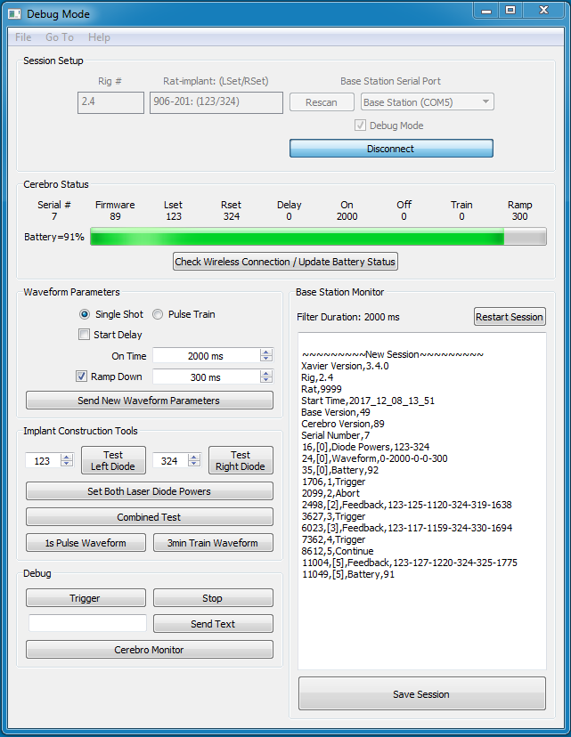
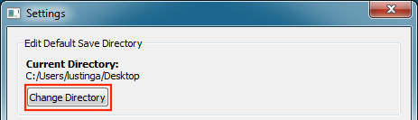
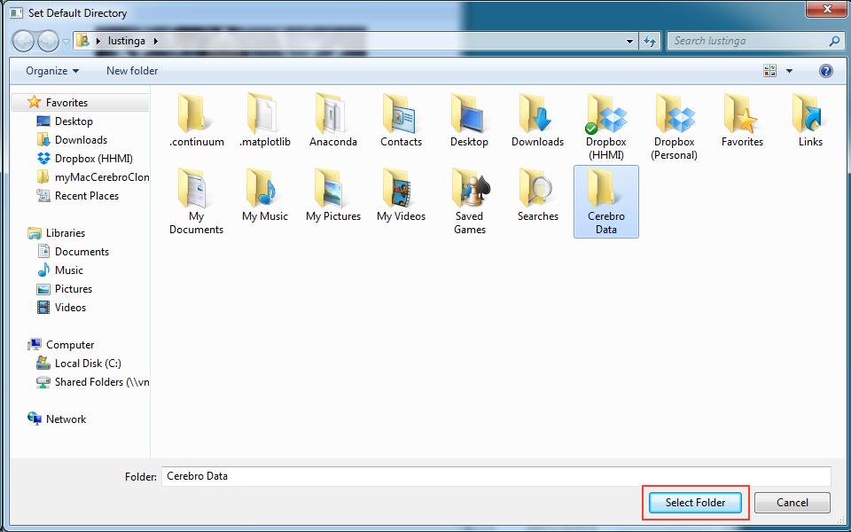
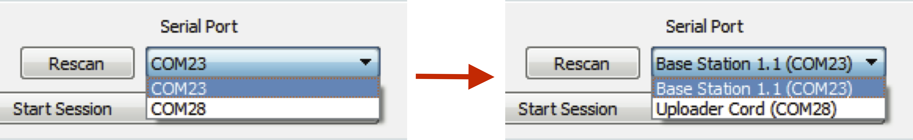
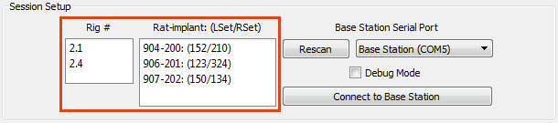
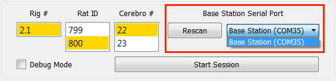
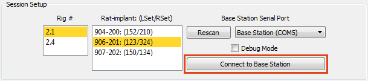
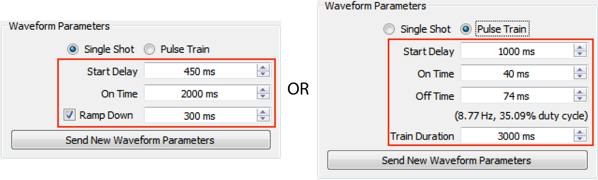

:github_url: https://github.com/Karpova-Lab/cerebro
======
Xavier
======



Installation
===================

System Requirements
-------------------
  - Windows XP or newer

  .. _setup default:

Download Instructions
---------------------
1. Download and install the `USB-Serial Windows Driver Installer <http://www.cypress.com/documentation/software-and-drivers/usb-serial-software-development-kit>`_ 
2. Download and unzip :download:`Xavier Deployment Folder<Deployment.zip>`
3. Open up Xavier.exe

.. figure:: photos/Install/Xavier_open.png
    :align: center
    :scale: 75%

4. Setup a :ref:`default directory<edit default directory>` that data will be saved to.


Settings
========
Access Xavier Settings by navigating to **File->Settings..** or by pressing :kbd:`Ctrl` + :kbd:`,`

.. figure:: photos/Settings/settings_dialog.png
    :align: center
    :width: 100%

.. note::
  Settings cannot be changed in the middle of a session

.. _edit default directory:

Edit Default Save Directory
-------------------------------

1.  Click ``Change Directory`` to setup a new save location.



2. Navigate to an existing folder or create a new folder for future data.

.. figure:: photos/Settings/new_folder.png
    :align: center
    :scale: 60%

3. Finally, click **Select Folder**. The "Current Directory" will reflect updated save path



.. figure:: photos/Settings/directory_changed.png
    :align: center
    :width: 100%

.. _add items:

Edit Session Setup Lists
------------------------
Adding Items
````````````
Type new items into the textboxes and click ``Add Item`` (or press :kbd:`Enter`)

.. image:: photos/Settings/additem.gif
  :align: center
  :width: 100%

Removing Items
``````````````
Select the item from list you want to remove and click ``Remove Selected``

.. image:: photos/Settings/removeitem.gif
  :align: center
  :width: 100%

.. _label ports:

Labeling COM Ports
------------------
When multiple usb devices are connected to the computer, it can be hard to keep track of which COM Port belongs to which device. To minimize confusion when connecting
to serial ports, Xavier allows you to label COM Ports.



Adding Labels
`````````````
1. From the dropdown box, select the COM Port you want to add a label to
2. Type the new label into the textbox and click ``Add/Edit Label`` (or press :kbd:`Enter`)

.. image:: photos/Settings/addlabel.gif
  :align: center
  :width: 100%

Editing Labels
``````````````
1. Double-click the labeled COM Port from the list that you want to edit. A label editing dialog will appear.
2. Type the new label into the textbox and click ``Change Label``

.. image:: photos/Settings/editlabel.gif
  :align: center
  :width: 100%

Removing Labels
```````````````
Select the labeled COM Port from the list that you want to remove and click ``Remove Selected``

.. image:: photos/Settings/removelabel.gif
  :align: center
  :width: 100%


Running an Experiment
=====================

.. _start session:

Session Setup
-------------
1. Fill out experimental setup information.



.. note::
  The rig and rat lists can be :ref:`edited <add items>`

2. Select a Base Station Serial Port.



.. note::  
  The COM port drowdown list can be :ref:`labeled<label ports>`

3. Click ``Connect to Base Station``



4. A startup sequence dialog box will appear. Xavier will try to establish a connections with Base Station and Cerebro. Once connected, Xavier will make sure that the laser diode power settings on Cerebro match laser diode powers for the rat/implant that was selected in step 1. If there are red X's, make sure the correct Serial Port was selected, make sure Cerebro has been turned on, and then click ``Retry``

.. image:: photos/Start_session/startup_seq_error.png
    :align: center
    :width: 100%

5. If everything on the list is checked, click ``Start Session`` to begin the session. 

.. image:: photos/Start_session/start_session.png
    :align: center
    :width: 100%

.. _waveform parameters:

Edit Waveform Parameters
------------------------
Five waveform parameters (Start Delay, On Time, Off Time, Train Duration, Ramp Down) can be wirelessly changed throughout the session.
The user can make changes using either a **Single Shot** mode with an optional ramp down or **Pulse Train** mode. Non-applicable 
parameters are automatically set to zero depending on the options selected.

.. image:: photos/Edit_waveform/parameter_diagram.png
    :align: center
    :width: 100%

1. Check the Cerebro Status to determine whether the waveform parameters are set as you wish.

.. image:: photos/Edit_waveform/check_waveform.png
    :align: center
    :width: 100%

2. If you would like to modify the parameters, select "Single Shot" or "Pulse Train", then modify the parameters in the "Waveform Parameters" section



3. Click ``Send New Waveform Parameters``.


Ending a Session and Saving Data
--------------------------------

1. When you are ready to end the session click ``Save Session``

